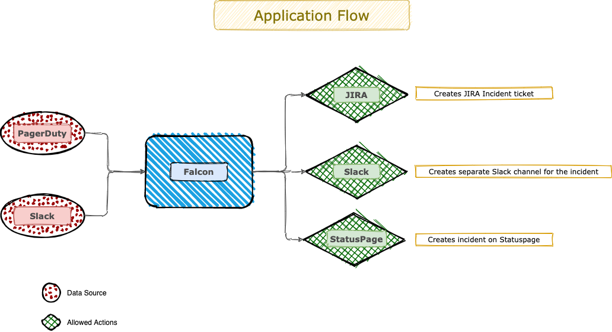
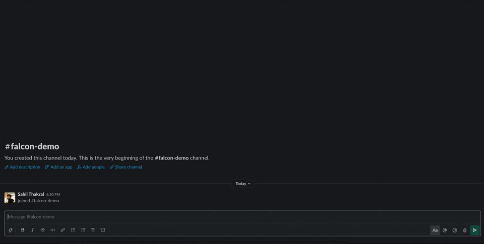

    

Falcon is an open-source incident management tool that is capable of acting as the first respondent to any alert. 

## What is Falcon?

Falcon allows you to respond to any incident either manually (through Slack) or automatically by integrating it with pagerduty. It automates the on-call engineers' tasks to inform all the relevant stakeholders by performing the following tasks:
- Create a **JIRA ticket** for the incident.
- Create a **Slack channel** with the name of the JIRA ticket and adds relevant team members to the channel.
- Create a **StatusPage Incident** for the incident.

## How it works?

    

## How can it be used?

From the above section we know how falcon works, now to use it we can either use it through Slack by [creating a Slack app](https://api.slack.com/authentication/basics) in our respective Slack workspace or by [integrating it with pagerduty as a webhook](https://support.pagerduty.com/docs/webhooks).

## How to use falcon with Slack

Below are the supported Slack commands:
- /falcon “issue” “`<issue-title>`” “`<severity>`” “`[service_compA,service_compB, ..]`” - Creates a JIRA issue, a StatusPage incident and a Slack channel for the incident. The severity and components fields parameters are optional. Only the following values are valid for the “severity” field - “minor”, “major”, “critical”.
- /falcon “statuspage-incident” “`<issue-title>`” “`<severity>`” “`[compA,compB, ..]`” - Creates a StatusPage incident entry for the incident and syncs it with the Slack channel from which it is used. The severity and components fields parameters are optional. Only the following values are valid for the “severity” field - “minor”, “major”, “critical”.
- /falcon “comment” “`<status>`” “`<comment>`” - Adds the same comment to JIRA and StatusPage. The status of Statuspage can also be modified. (Jira issue is also closed if the status is “resolved” in the command.)
- /falcon “comment-jira” “`<status>`” “`<comment>`” - Adds the comment to the JIRA issue. The status field is optional in the command and can only have the value “resolved” to close the Jira issue.
- /falcon “comment-statuspage” “`<status>`” “`<comment>`” - Modify the status of StatusPage and add the comment to the same StatusPage.
- /falcon “help” - To display this help menu.

*Note: Use double quotes ( “” ) while using the Falcon, otherwise it will return a formatting error.*

*Note: Falcon commands can only be used for commenting from the Incident Slack Channel triggered by Falcon*

*Note: Only the following values are valid for the “status” field - “current”, “identified”, “investigating”, “monitoring” and “resolved”. Current keeps the current status of the StatusPage incident, while other values update the status of StatusPage.*

## Falcon In Action (with Slack)

    

## How to configure Falcon?

To make configuration changes go to `src/config/constants.json`

| Config Parameter                 | Default Value | Description |
|----------------------------------|---------------|-------------|
| application_port                 | 8000          | The port on which the application will run |
| statuspage.page_id               | none          | The statuspage page_id under which the incident will be created |
| statuspage.deliver_notifications | false         | Whether to deliver notifications to relevant stakeholders or not through statuspage for the incident |
| jira.base_endpoint               | none          | The JIRA endpoint used by your organization |
| jira.issue_type_id               | none          | JIRA custom_field_id for the type of issue that will be created by falcon |
| jira.project_id                  | none          | JIRA project_id under which the issue will be created for the incident |
| slack.notification_channel_ids   | none          | Comma separated Slack channel ids on which a notification needs to be sent for the incident |

## How to Build Falcon

### Prerequisites
    
    - Golang [version > 1.14]

### Building from source

Before running the application please set the below mentioned environment variables to allow access to respective services:

| Environment Variable      |
|---------------------------|
| STATUSPAGE_ACCESS_TOKEN   |
| PAGERDUTY_ACCESS_TOKEN    |
| JIRA_USERNAME             |
| JIRA_PASSWORD             |
| SLACK_ACCESS_TOKEN        |

To build falcon from the source code yourself you need to have a working Go environment with version 1.14 or greater 
installed. Then, follow the below steps to run falcon locally

    - git clone falcon.git
    - cd falcon/src
    - go get
    - go build -o falcon
    - ./falcon

### Build Docker Image from source

    - git clone falcon.git
    - cd falcon
    - docker build --tag falcon:latest .
    - docker run --name falcon -d -p 8000:8000 falcon:latest

Falcon will now be reachable at http://localhost:8000/.

## How to test?

Once you are able to run the application then you might want to test it locally as well. Flcon can be 
tested with curl requests. Below is an example of a curl request for falcon's "help" command:

    curl --location --request POST 'http://localhost:8000/slack/comment' \
    --header 'Content-Type: application/x-www-form-urlencoded' \
    --data-urlencode 'text="help"' \
    --data-urlencode 'response_url=<callback_url>' \
    --data-urlencode 'user_name=<slack_user_name eg. sahil.thakral>' \
    --data-urlencode 'user_id=<slack_user_id eg. U12345678>'

## How to Contribute?

We  ❤️  PR's

Contribution, in any kind of way, is highly welcome! It doesn't matter if you are not able to write code. Creating 
issues and helping other people to use [falcon](https://github.com/olxgroup-oss/falcon) is a contribution, too! A 
few examples:

-   Correcting typos in the README / documentation
-   Reporting bugs
-   Implementing a new feature or endpoint
-   Sharing the love of [falcon](https://github.com/olxgroup-oss/falcon) and helping people to get use to it

If you are new to pull requests, checkout  [Collaborating on projects using issues and pull requests / Creating a pull request](https://help.github.com/articles/creating-a-pull-request/).

## License

(c) Copyright 2019-2020 [OLX](https://olxgroup.com). Released under [Apache 2 License](LICENSE)
